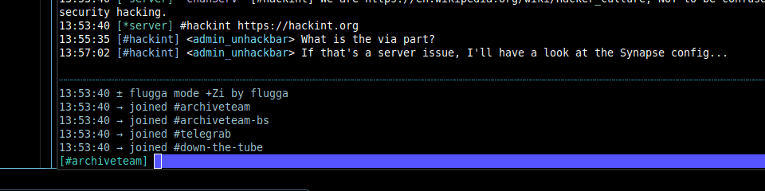

# euphrates

A terminal IRC client with a unified, group-toggleable chat view.

## Concept

Instead of channel tabs, every joined channel is assigned to one of 10 numeric
**groups** (plus two special groups: server messages and private queries).
Channel messages are interleaved in a single scroll pane prefixed with
`[#channel]`. **Alt+1**…**Alt+0** toggles the visibility of groups 1-10
(think `nmon` modules).

The composer is prefixed with the current target channel in brackets; the
prefix dims when the target's group is hidden, and submitting a message
force-shows the target group again. Cycle through joined channels with
**Ctrl-N** / **Ctrl-P**.



## Build

```
make
```

## Cross-build

Build raw release binaries for these targets from a Linux host:

- windows/amd64
- darwin/arm64
- linux/amd64
- linux/arm64

```bash
make release
```

Artifacts are written to `dist/` as:

- `dist/euphrates-windows-amd64.exe`
- `dist/euphrates-darwin-arm64`
- `dist/euphrates-linux-amd64`
- `dist/euphrates-linux-arm64`

Clean release artifacts:

```bash
make clean-dist
```

## Run

```
./euphrates -server irc.libera.chat:6697 -tls -nick yournick -channels '#foo,#bar'
```

Inside the devcontainer, an Ergo IRC sidecar is available at `irc:6667`.
Example:

```
./euphrates -server irc:6667 -nick yournick -channels '#euphrates'
```

Run `./euphrates -h` for the full flag list (SASL, server password, ring
capacities).

## Grouping Strategies

Euphrates can load ordered Lua grouping strategies from `--grouping-dir`
(default: `~/.config/euphrates/grouping.d`). Strategies run in lexical filename
order and the first strategy that returns a valid full assignment is used.

Starter strategies are included in `examples/grouping/`:

- `010_common_prefix.lua`: group a newly joined channel with the existing
	channel that shares the longest common prefix (minimum 4 characters after the
	channel sigil).
- `020_delimiter_stem.lua`: group channels sharing a prefix before `-`, `_`, or
	`.` (for example `#python-dev`, `#python-help`, `#python-jobs`).

Install them with:

```bash
mkdir -p ~/.config/euphrates/grouping.d
cp examples/grouping/*.lua ~/.config/euphrates/grouping.d/
```

## Layout

### Status line
```
irc.libera.chat 1⣧ 2⡄ 3⡆ 4⣧ 5⡀ 6⡀ 7⡄ 8⡀ 9 0  S Q              22 channels
```

- **Server label:** the leftmost text is the configured server name (falls back to "server" if unset).
- **Numeric groups (1–0):** each digit toggles one of the 10 numeric groups (Alt+1…Alt+0). The small braille glyph after the digit shows how many channels are assigned to that group (0 → ⠀, 1 → ⡀, … 8+ → ⣿);
- **S / Q markers:** `S` indicates the server messages group and `Q` indicates private queries; these markers show whether the corresponding special group is visible.
- **Visibility styling:** markers are bright when a group is visible and dimmed when hidden.
- **Channel count (right):** total number of normal channels across numeric groups (excludes the server pseudo-channel and queries).


### Messages
```
11:29:56 [#foo] <alice> hello
11:30:24 [#bar] <bob> hi
```

The main pane is a unified scrollback view that displays all messages from visible channels and queries. Each line contains:

- **Timestamp** (HH:MM:SS): local time when the message was sent.
- **Channel prefix** ([#name] or [@nick]): the source channel or private query.
- **Nick** (<nick>): the sender's username.
- **Message**: the message text, wrapping as needed.

Messages from all visible groups are interleaved chronologically, making it easy to follow conversations across multiple channels simultaneously. Scrolling up and down (when the composer is empty) navigates through the history.

### Events
```
…………………………………………………………………………
→ alice joined #foopane
± #bar mode +o alice
```

Events are separated from the main message pane for readability. The events pane is a fixed 5-line section that displays IRC activity such as:

- **Joins and parts:** users entering or leaving channels (→ nick joined / ← nick left).
- **Mode changes:** channel operator status, voice, and other modes (± #channel mode +o nick).
- **Topic changes:** when a channel topic is updated.
- **Nick changes:** when a user changes their nickname.

Events use visual symbols (→, ←, ±) to quickly distinguish event types without cluttering the message history. This keeps the scrollback clean and lets you focus on conversations while still monitoring activity.

### Composer
```
[#foo] |
```

The input line is prefixed with the current target channel in brackets. The prefix dims when the target's group is hidden. Submitting a message in a hidden group automatically re-shows that group. Use **Ctrl-N** / **Ctrl-P** to cycle through joined channels and change the target.

## Keys

| Key            | Action                                  |
| -------------- | --------------------------------------- |
| Alt+1..0       | Toggle visibility of numeric group 1-10 |
| F1..F10        | Solo numeric group 1-10                 |
| Ctrl-N         | Next channel (target)                   |
| Ctrl-P         | Previous channel (target)               |
| Up / Down      | Scroll main message history (input empty) |
| Ctrl-C         | Quit                                    |
| `/me <text>`   | Send a CTCP ACTION to the target        |
| `/quit [text]` | Disconnect                              |

## Testing

```
make test       # plain
make test-race  # with the race detector
make test-e2e   # in-process network e2e (no external services)
make test-integration  # live IRC integration (defaults to IRC_TEST_ADDR=irc:6667)
make lint       # vet + gofmt + (optional) golangci-lint
```

### Devcontainer sidecar

The devcontainer now uses Docker Compose with two services:

- `app`: Go development container attached by VS Code.
- `irc`: Ergo IRC test server sidecar.

`make test-integration` is intended to run inside this environment.

## Theme

Euphrates uses a subtle **Neon noir** theme by default. Theme contributions are welcome!

- Cyan accents for status, separators, and prompt chrome.
- Deterministic coloring of channels and nicks.
- The renderer automatically falls back by terminal capability:
	- truecolor terminals use 24-bit theme values,
	- 256-color terminals use a matched 256 palette,
	- basic terminals use conservative colors for readability.

If your terminal renders faint/dim text poorly, set `EUPHRATES_NO_DIM=1` to
disable dimmed styling and use the readability-safe fallback tone instead.